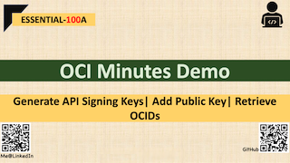

# ESSENTIAL-100A | Generate API Signing Keys|Add Public Key| Retrieve OCIDs

## Overview

The demo will cover three tasks

1.  will generate a API Signing Keys (RSA Key Pair).
2. Add Public Key to User **[Follow the Video]**
3. Retrieve OCIDs (eg: Tenancy/USER/Compartment etc) **[Follow Video]**

## Steps for generating API Signing Keys:
- Create Directory (**OPTIONAL**)
- Generate Private Key
- Change Permission
- Generate Public Key
- Get the Key's Fingerprint (**OPTIONAL**)

### 1. Create Directory (OPTIONAL)
	mkdir ~/.oci # if not created already

### 2. Generate Private Key
    ---To Generate a Key with no passphrase
    $ openssl genrsa -out ~/.oci/oci_api_key_private.pem 2048
    OR
    ---To Generate a key with passpgrase
    openssl genrsa -out ~/.oci/oci_api_key.pem_private -aes128 2048 
### 3. Change Permission    
	chmod go-rwx ~/.oci/oci_api_key_private.pem

### 4. Generate Public Key
	openssl rsa -pubout -in ~/.oci/oci_api_key_private.pem -out ~/.oci/oci_api_key_public.pem

### 5.Get the Key's Fingerprint (OPTIONAL)
	openssl rsa -pubout -outform DER -in ~/.oci/oci_api_key_private.pem | openssl md5 -c

## Add Public Key & Retrieve OCID:

Please follow the youtube video below.

## Useful Weblink

[OCI Documentation for API Signing Keys](https://docs.cloud.oracle.com/en-us/iaas/Content/API/Concepts/apisigningkey.htm)

## Demo @ Youtube (Click on below image)

