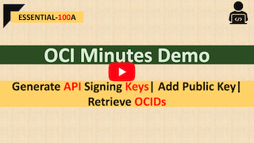

# ESSENTIAL-100A | Generate API Signing Keys|Add Public Key| Retrieve OCIDs

## Overview

The demo will cover three tasks

1.  Generate API Signing Keys (RSA Key Pair).
2. Add Public Key to User
3. Retrieve OCIDs (eg: Tenancy/User/Compartment)

## 1. Generate API Signing Keys (RSA Key Pair).
- Create Directory (**OPTIONAL**)
- Generate Private Key
- Change Permission
- Generate Public Key
- Get the Key's Fingerprint (**OPTIONAL**)

#### i. Create Directory (OPTIONAL)
```shell
mkdir ~/.oci # if not created already
```

#### ii. Generate Private Key
```shell
---To Generate a Key with no passphrase
$ openssl genrsa -out ~/.oci/oci_api_key_private.pem 2048
OR
---To Generate a key with passpgrase
$ openssl genrsa -out ~/.oci/oci_api_key.pem_private -aes128 2048 
```
#### iii. Change Permission    
```shell
$ chmod go-rwx ~/.oci/oci_api_key_private.pem
```

#### iv. Generate Public Key
```shell
$ openssl rsa -pubout -in ~/.oci/oci_api_key_private.pem -out ~/.oci/oci_api_key_public.pem
```

#### v.Get the Key's Fingerprint (OPTIONAL)
```shell
$ openssl rsa -pubout -outform DER -in ~/.oci/oci_api_key_private.pem | openssl md5 -c
```

## 2. Add Public Key to User

```diff
-- Please follow the youtube video
```

## 3. Retrieve OCIDs (eg: Tenancy/User/Compartment)

```diff
-- Please follow the youtube video
```

## Useful Links

[OCI Documentation for API Signing Keys](https://docs.cloud.oracle.com/en-us/iaas/Content/API/Concepts/apisigningkey.htm)

## Demo @ Youtube

[](https://youtu.be/T9jq2Wd3d0U "Click to watch on YouTube")


