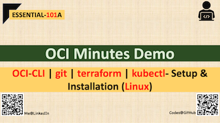

# OCI-CLI | git | terraform | kubectl - Setup & Installation (Linux) | ESSENTIAL-101A

## Overview

##### Prepare a dev/ops client machine:

- Install and Configure Oracle Cloud Infrastructure Command Line Interface (**OCI-CLI**)
- Install **git** client
- Install **terraform** client
- Install **kubectl** client

## Prerequisite:

Follow tutorial [ESSENTIAL-100A](../ESSENTIAL-100A) to **generate API Signing Key**, **add public key** to user account and retrieve required **OCID** (user/tenancy/compartment). This will be needed while configuring OCI-CLI

## Steps:

##### A. Install and Configure OCI-CLI (Linux)

```shell
## Install
$ bash -c "$(curl -L https://raw.githubusercontent.com/oracle/oci-cli/master/scripts/install/install.sh)" ## accept all the default values

## Configure
$ oci setup config ## Say No when prompts- Do you want to generate a new API Signing RSA Key Pair (already generated keys following ESSENTIAL-100A demo tutorial as mentioned in Prerequisite)

## Test
$ oci os ns get ## expected to return the namespace of tenancy
```


##### B. Install git (Linux)

```shell
## Install
$ sudo yum install git

## Configure
$ git config --global user.name "Jahangir Alam"
$ git config  --global user.email "jahangir2526@gmail.com"
$ git config --global color.ui "auto"

## Test
$ git clone <git_url>
```

##### C. Install terraform client (Linux)

```shell
$ wget https://releases.hashicorp.com/terraform/0.13.5/terraform_0.13.5_linux_amd64.zip ## check the latest version from download url
$ unzip terraform_0.13.5_linux_amd64.zip
$ sudo mv terraform /usr/local/bin
$ terraform -help
```

##### D. Install kubectl CLI

```shell
$ curl -LO https://storage.googleapis.com/kubernetes-release/release/`curl -s https://storage.googleapis.com/kubernetes-release/release/stable.txt`/bin/linux/amd64/kubectl

$ chmod +x ./kubectl
$ sudo mv ./kubectl /usr/local/bin/kubectl
$ kubectl version --client
```


## Useful Weblink

**CLI-quickstart:** https://docs.cloud.oracle.com/en-us/iaas/Content/API/SDKDocs/cliinstall.htm

**git-cli:** https://git-scm.com/downloads

**terraform-cli: (download)** https://www.terraform.io/downloads.html

**terraform-install:** https://learn.hashicorp.com/tutorials/terraform/install-cli

**install-kubectl:** https://kubernetes.io/docs/tasks/tools/install-kubectl/


## Demo @ Youtube (Click on below image)

[](https://myyoutube "Click to watch on YouTube")


