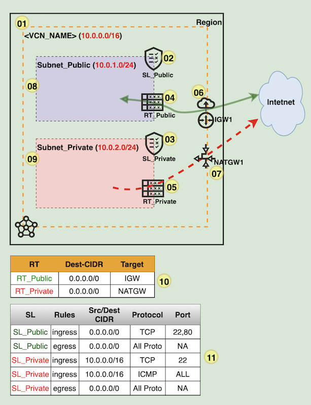
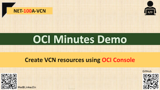

# Create VCN resources using OCI Console | NET-100A-VCN

## Overview

This demo will create a **VCN** with **2xSL, 2xRT, IGW, NATGW** <u>**using console**</u> and later add firewall & route rules.

## Architecture

## Steps:

  1. Create **<VCN_NAME>**
  2. Create **SL_Public**
  3. Create **SL_Private**
  4. Create **RT_Public**
  5. Create **RT_Private**
  6. Create **IGW1**
  7. Create **NATGW1**
  8. Create **Subnet_Public**
  9. Create **Subnet_Private**
  10. Add **Route rules**
  11. Add **Security Rules**

## Demo @ Youtube (Click on below image)
