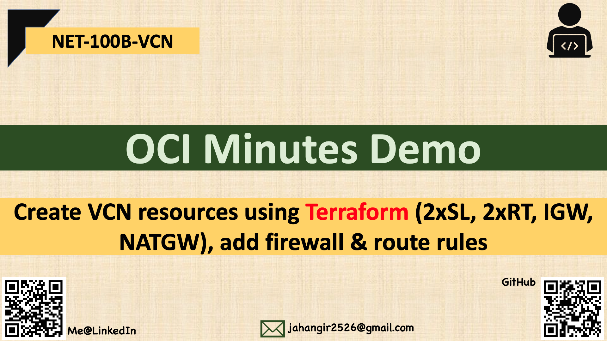
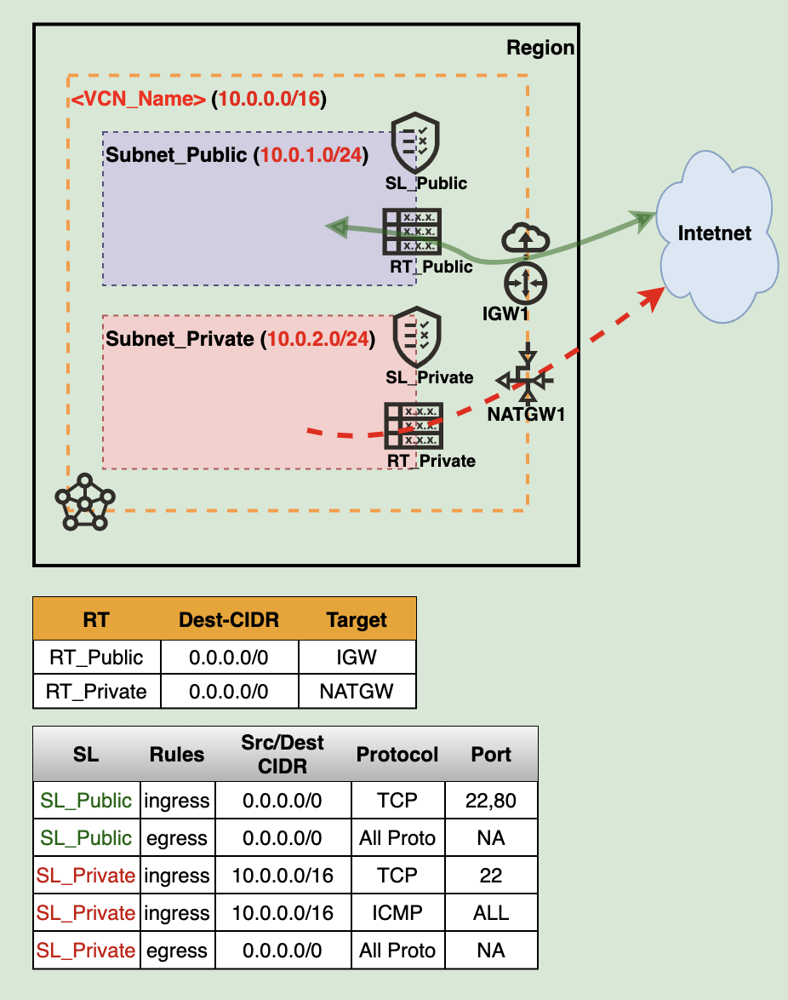

## 

### Steps To Follow:

  1. download **scripts/terraform_vcn_skeleton_okit.zip** where terraform client installed

  2. unzip **terraform_vcn_skeleton_okit.zip** 

  3. open **terraform.tfvars** and provide values for all parameters.

  4. You can rename **MY-VCN** to any custom VCN name by opening **main.tf** file and update **display_name   = "MY-VCN100"**

  5. double check the **region/compartment_ocid**

  6. terraform **init**

  7. terraform **plan**|**apply**|**destroy**

     

     ------

     

------

