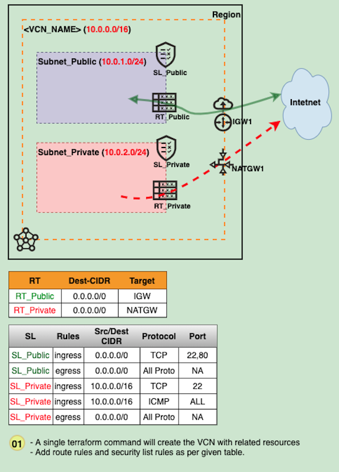

# NET-100B-VCN : Create VCN resources using Terraform

## Overview

This demo will create a **VCN** with **2xSL, 2xRT, IGW, NATGW** **<u>using terraform</u>** and add necessary firewall & route rules.

## Architecture

## Steps:

- Copy the directory **scripts/terraform_vcn_skeleton_okit** to a local directory (eg: ~/my-vcn-terraform)

  `cp scripts/terraform_vcn_skeleton_okit ~/my-vcn-terraform`

  `cd ~/my-vcn-terraform`

- open file **terraform.tfvars** and provide vaules for all parameters

- Run the terraform command

  `$ terraform init`

  `$ terraform plan`

  `$ terraform apply`    ## if you want to provision the infrastructure

  `$ terraform destory`   ## if you want to destroy the infrastructure

## Youtube Video: 

