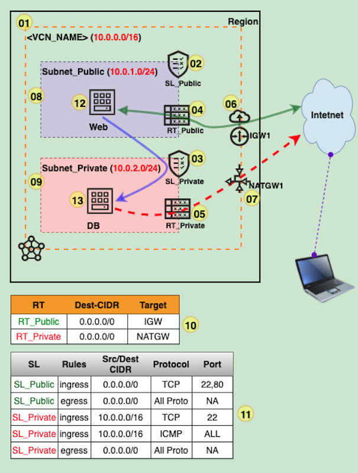

# NET-200A-VCN : Launch WebServer in Public Subnet and DB in Private Subnet

## Overview

1. Create VCN and related resources
2. Launch WebServer and DB host
3. Test by accessing the web application, download patch/soft from DB host

## Prerequisite

1. You must create the VCN and related resources following the **"NET-100A-VCN"** or **"NET-101A-VCN"** demo

## Architecture

## Steps:

**1-11.** Follow the demo **"NET-100A-VCN"** or **"NET-101A-VCN"**

12. Launch a WebServer in Subnet_Public
13. Launch a DB host in Subnet_Private

## Demo@Youtube: 

