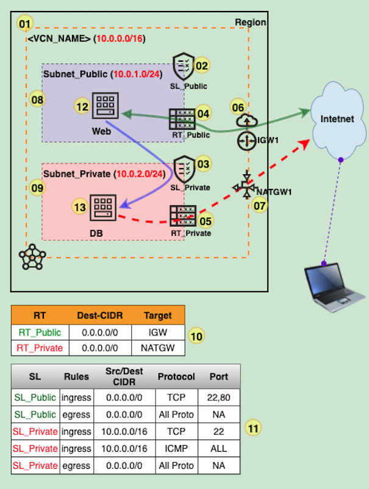

# NET-200A-VCN : Launch WebServer in Public Subnet and DB in Private Subnet

## Overview

1. Create VCN and related resources
2. Launch WebServer and DB host
3. Test by accessing the web application, download patch/soft from DB host

## Prerequisite

1. You must create the VCN and related resources following the **"NET-100A-VCN"** or **"NET-101A-VCN"** demo

## Architecture

## Steps:

1-11. Follow the demo

  2. Create **SL_Public**
  3. Create **SL_Private**
  4. Create **RT_Public**
  5. Create **RT_Private**
  6. Create **IGW1**
  7. Create **NATGW1**
  8. Create **Subnet_Public**
  9. Create **Subnet_Private**
  10. Add **Route rules**
  11. Add **Security Rules**

## Youtube Video: 

