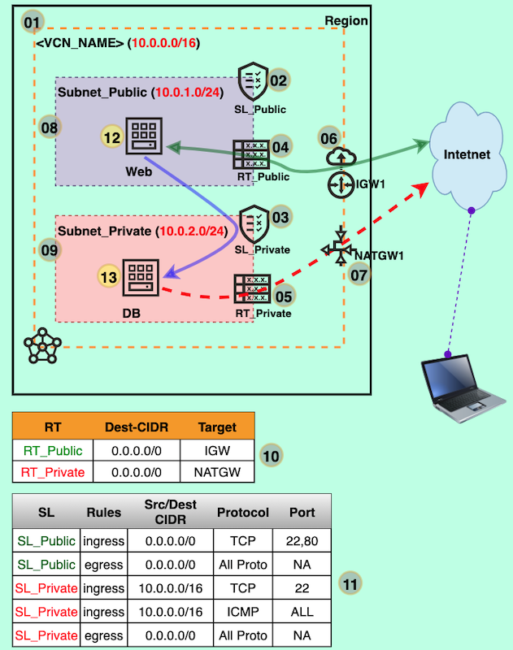
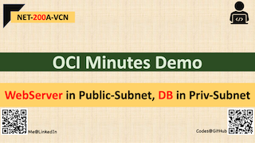

# NET-200A-VCN : WebServer in Public-Subnet, DB in Priv-Subnet

## Overview

- Create VCN and related resources
- Launch WebServer with cloud-init [oci-cloud-init-httpd-webserver_v1.sh](../Common-Scripts/oci-cloud-init-httpd-webserver_v1.sh) in Public Subnet and DB host in Private Subnet
- Test by accessing the web site, download patch/soft from DB host

## Prerequisite

You must create the VCN and related resources following the [**"NET-100A-VCN"**](../NET-100A-VCN) or [**"NET-100B-VCN"**](../NET-100B-VCN) demo

## Architecture



## Steps:

- Provision Infrastructure and Launch instances
- Test the Website
- Test the DB host to download software/patch/updates

#### A. Provision Infrastructure and Launch instances

**1-11.** Follow the demo [**"NET-100B-VCN"**](../NET-100B-VCN) 

12. Launch a WebServer in Subnet_Public using console
13. Launch a DB host in Subnet_Private using console

#### B. Testing the web site access

- Get the Public IP of WebServer 
- Create an A record (**optional**) pointing to Public IP
- Access website.

#### C. Test db one-way access to internet (via NATGW)

##### Connect to db host using proxy command (via WebServer)

```shell
$ ssh -t -o ProxyCommand='ssh -i <PRIV_KEY> user@<PUBLIC_IP> -W %h:%p %r' -i <PRIV_KEY> user@<PRIV_IP>
$ ping www.google.com
$ sudo yum install telnet -y
```

##### Install mongodb

```shell
$ sudo -i
# cat > /etc/yum.repos.d/mongodb-org-4.4.repo
[mongodb-org-4.4]
name=MongoDB Repository
baseurl=https://repo.mongodb.org/yum/redhat/$releasever/mongodb-org/4.4/x86_64/
gpgcheck=1
enabled=1
gpgkey=https://www.mongodb.org/static/pgp/server-4.4.asc
```

Install the latest stable version of MongoDB

```shell
$ sudo yum install -y mongodb-org 
```


## Demo @ Youtube (Click on below image)

[](https://my_youtube "Click to watch on YouTube")


