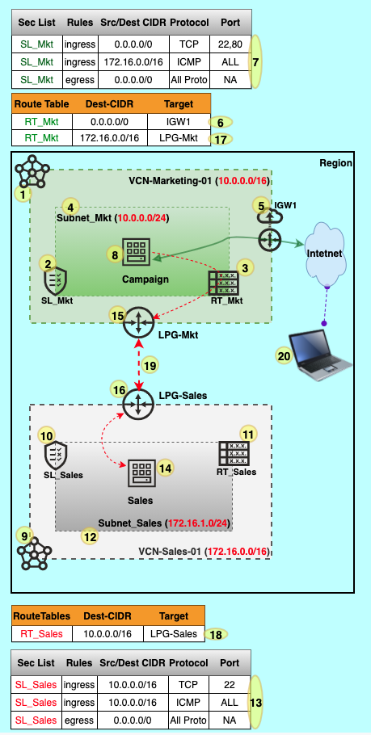
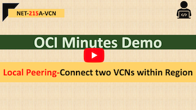

# NET-215A-VCN | Local Peering- Connect two VCNs within Region

## Overview

This demo will walk you through the steps to establish a local peering connection within a region.

## Prerequisite

## Architecture

## Steps

| @ VCN-Marketing-01                                 | @ VCN-Sales-01                                     |
| -------------------------------------------------- | -------------------------------------------------- |
| **1.** Crete **VCN-Marketing-01 (10.0.0.0/16)**    |                                                    |
| **2.** Create **SL_Mkt**                           |                                                    |
| **3.** Create **RT_Mkt**                           |                                                    |
| **4.** Create **Subnet_Mkt (10.0.0.0/24)**         |                                                    |
| **5.** Create **IGW1**                             |                                                    |
| **6.** Add route at **RT_Mkt** to **IGW1**         |                                                    |
| **7.** Add firewall rules to **SL_Mkt**            |                                                    |
| **8.** Launch Instance (eg: **Campaign_App01**)    |                                                    |
|                                                    | **9.** Create **VCN-Sales-01 (172.16.0.0/16)**     |
|                                                    | **10.** Create **SL_Sales**                        |
|                                                    | **11.** Create **RT_Sales**                        |
|                                                    | **12.** Create **Subnet_Sales (172.16.1.0/24)**    |
|                                                    | **13.** Add firewall rules to **SL_Sales**         |
|                                                    | **14.** Launch Instance (eg: **Sales_App01**)      |
| **15.** Create **LPG-Mkt**                         | **16.** Create **LPG-Sales**                       |
| **17.** Add route at **RT_Mkt** to **LPG-Mkt**     | **18.** Add route at **RT_Sales** to **LPG-Sales** |
| **19.** **Establish** Local Peering **Connection** |                                                    |
|                                                    |                                                    |
|                                                    |                                                    |

## Test Case 1:

20. Connect to **Campaign_App01** and **ping Sales_App01**

## Useful Weblink

VCN Peering: https://docs.cloud.oracle.com/en-us/iaas/Content/Network/Tasks/VCNpeering.htm

Local VCN Peering: https://docs.cloud.oracle.com/en-us/iaas/Content/Network/Tasks/localVCNpeering.htm#Local_VCN_Peering_Within_Region

## Demo @ Youtube (Click on below image)

