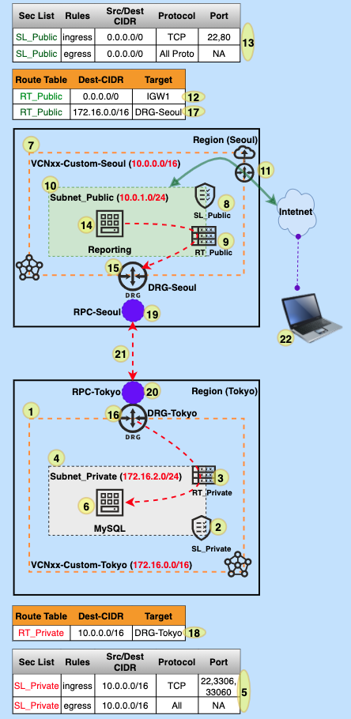

# NET-215B-VCN | Remote Peering-Connect two VCNs across Regions


## Overview

This demo will walk you through to establish a remote peering connection between two regions.

## Prerequisite


## Architecture



## Steps

| @REGION - SEOUL                                              | @REGION - TOKYO                                     |
| ------------------------------------------------------------ | --------------------------------------------------- |
|                                                              | **1.** Create **VCN (172.16.0.0/16)**               |
|                                                              | **2.** Create **SL_Private**                        |
|                                                              | **3.** Create **RT_Private**                        |
|                                                              | **4.** Create **Subnet_Private**                    |
|                                                              | **5.** Add firewall rules to **SL_Private**         |
|                                                              | **6.** Launch **ComputeVM/DB_Host**                 |
| **7.** Create **VCN (10.0.0.0/16)**                          |                                                     |
| **8.** Create **SL_Public**                                  |                                                     |
| **9.** Create **RT_Public**                                  |                                                     |
| **10.** Create **Subnet_Public**                             |                                                     |
| **11.** Create **IGW1**                                      |                                                     |
| **12.** Add **route** to **RT_Public** to **IGW1**           |                                                     |
| **13.** Add firewall rules to **SL_Public**                  |                                                     |
| **14.** Launch a **Compute VM/ Web Server**                  |                                                     |
|                                                              |                                                     |
| **15.** Create **DRG-Seoul** & **attach to VCN**             | **16.** Create **DRG-Tokyo** & **attach to VCN**    |
| 17. Add route RT_Public to DRG-Seoul                         | 18. Add route RT_Private tp DRG-Tokyo               |
| **19.** Create **RPC-Seoul**                                 | **20.** Create **RPC-Tokyo**                        |
|                                                              |                                                     |
| **21.**                                                      |                                                     |
| **a.** Go to **RPC-Seoul** -> **Establish Connection**       | **b.** get the **OCID of RPC-Tokyo**                |
| **c.** **select** region (**Tokyo**) then **provide** the **OCID of RPC-Tokyo** |                                                     |
|                                                              |                                                     |
|                                                              | **22.** Check  connecting to Compute VM then to DB. |

## Test Case 1:

```bash
## Connect to Web as opc
$ ping <MYSQL_IP>
$ sudo yum install telnet -y
$ telnet <MYSQL_IP> <MYSQL_Port>
```

## Test Case 2:

###### A. Install MySQL Shell on the Compute instance using the following commands:

```shell
shell> sudo yum install https://dev.mysql.com/get/mysql80-community-release-el7-3.noarch.rpm
shell> sudo yum install mysql-shell
```

###### B. Start MySQL Shell and connect to the MySQL DB System's endpoint using the following command:

```
shell> mysqlsh Username@MYSQL_IP
```

###### C. Run Sample Commands

```sql
mysql> SHOW DATABASES; 

mysql> CREATE DATABASE MYDB1;
mysql> USE MYDB1;
mysql> SHOW TABLES;

mysql> CREATE TABLE students (name VARCHAR(20), department VARCHAR(20), gpa VARCHAR(10));
mysql> SHOW TABLES;
mysql> DESCRIBE STUDENTS;

mysql>
INSERT INTO students VALUES ('A','CSE','2.2');
INSERT INTO students VALUES ('B','CS','3.2');
INSERT INTO students VALUES ('C','SE','4.0');

mysql> SELECT * FROM students;
```

## Useful Weblink

**Connect to MYSQL:** https://docs.cloud.oracle.com/en-us/iaas/mysql-database/doc/connecting-db-system.html

**mysql-shell-commands:** https://dev.mysql.com/doc/mysql-shell/8.0/en/mysql-shell-commands.html

**mysql shell 8.0 (pdf):** https://docs.oracle.com/cd/E17952_01/mysql-shell-8.0-en/mysql-shell-8.0-en.pdf


## Demo @ Youtube (Click on below image)

[](https://youtu.be/59uyIrfd1IY "Click to watch on YouTube")


