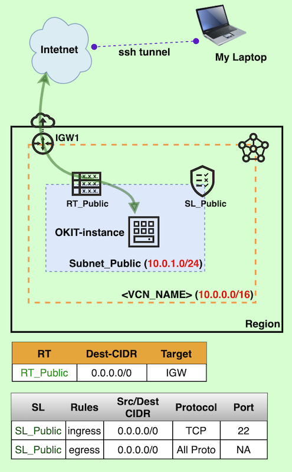

# OKIT-200A | OKIT - Setting UP in Minutes on OCI Compute

## Overview

The demo will launch an Compute instance and run **OKIT** (Oracle Designer ToolKit) as docker container

## Prerequisite

1. Create a VCN (dedicated for OKIT Only) as per **below architecture**. Ref. demo tutorial [NET-100A-VCN](NET-100A-VCN)
2. Generate **API Keys and retrieve OCIDs** (ignore if you have already) ... Ref. demo tutorial [ESSENTIAL-100A](ESSENTIAL-100A)

## Architecture

 

## Steps
- Launch Compute VM in Subnet_Public
- Install git,docker and okit
- Get API Private key and create config
- Run OKIT as docker container
- SSH tunnel to access OKIT Web (designer toolkit)

### 1. Launch VM with the following cloud-init scripts

Using OCI console, Launch a Compute VM in Subnet_Public

### 2. Login as opc, Install git, docker and build okit docker image

```shell
## Install docker-engine and git, start docker
## as opc
$ sudo yum install git docker-engine -y
$ sudo systemctl enable docker
$ sudo systemctl start docker
$ sudo groupadd docker
$ sudo usermod -aG docker opc

## LOGOUT & LOGIN AGAIN as opc

## clone latest oci-okit, build image
$ git clone https://github.com/oracle/oci-designer-toolkit.git
$ cd oci-designer-toolkit/
$ docker build -t okit .
```

### 3. Get API Private key and create config

```shell
$ mkdir -p /home/opc/okit/user/templates  ## location to store user template
$ mkdir ~/.oci && cd ~/.oci
## copy api private key here

cat > config
[<PROFILE_NAME>]
user=<USER_OCID>
fingerprint=<FINGER_PRINT>
key_file=~/.oci/<API_PRIVATE_KEY>
tenancy=<TENANCY_OCID>
region=<REGION_CODE>

## example config file
[DEFAULT]
user=ocid1.user.oc1..aaaaaaaaxxxxxxxxxxxxxxxxxxxxxxxxxxxxxxxxxxxxxxx
fingerprint=41:d9:70:a1:21:db:b1:82:c4:6c:xx:xx:xx:xx:xx:xx
key_file=~/.oci/oci_api_key_2020.pem
tenancy=ocid1.tenancy.oc1..aaaaaaaaxxxxxxxxxxxxxxxxxxxxxxxxxxxxxxxxxxxxxxxxxxxxxxx
region=ap-tokyo-1

[mytenancy2]
user=ocid1.user.oc1..aaaaaaaaxxxxxxxxxxxxxxxxxxxxxxxxxxxxxxxxxxxxxxx
fingerprint=41:d9:70:a1:21:db:b1:82:c4:6c:xx:xx:xx:xx:xx:xx
key_file=~/.oci/oci_api_key_2020.pem
tenancy=ocid1.tenancy.oc1..aaaaaaaaxxxxxxxxxxxxxxxxxxxxxxxxxxxxxxxxxxxxxxxxxxxxxxx
region=ap-tokyo-1
```

### 4. Run OKIT as docker container

```shell
$ docker run -d --rm -p 80:80 --volume /home/opc/okit/user/templates:/okit/templates --volume /home/opc/.oci:/root/.oci --name okit okit
```

### 5. SSH Tunnel to SECURE access to OKIT Web Server 

```shell
## At Local Machine execute the following and leave the terminal running
$ ssh -N -L <LOCAL_PORT>:127.0.0.1:<REMOTE_PORT> -i <PRIVATE_KEY> opc@<REMOTE_IP>

## example
$ ssh -N -L 8081:127.0.0.1:80 -i Common2020 opc@168.138.14.117
```


## Useful Weblink

**OKIT-github:** https://github.com/oracle/oci-designer-toolkit


## Demo @ Youtube (Click on below image)

[](https://youtu.be/59uyIrfd1IY "Click to watch on YouTube")


