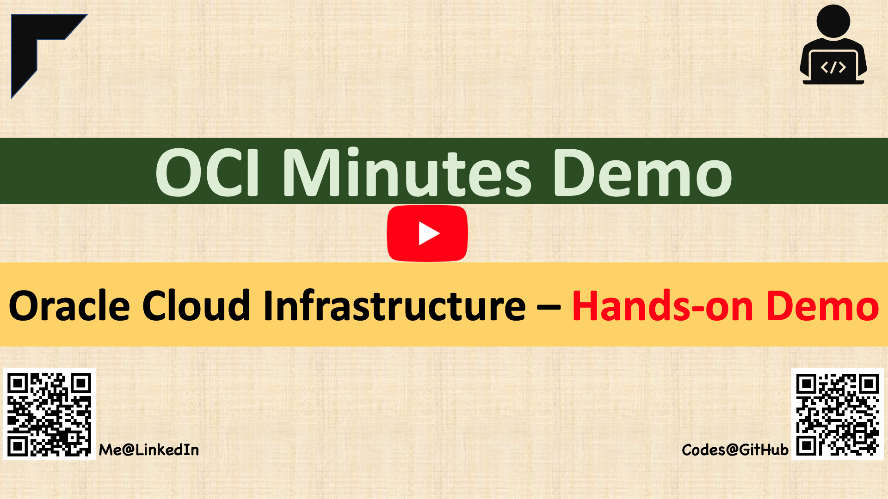

## TABLE OF CONTENTS

| Area        | Sub Area       | Code (GitHub)                                                | Topic (Click to watch the Youtube Video)                     | Status        |
| ----------- | -------------- | ------------------------------------------------------------ | ------------------------------------------------------------ | ------------- |
| Essentials  | NA             | [**ESSENTIAL-100A**](ESSENTIAL-100A_API-Keys_OCID)           | [Generate API Signing Keys \| Add Public Key \| Retrieve OCIDs](https://youtu.be/T9jq2Wd3d0U) | **Available** |
| Essentials  | NA             | [**ESSENTIAL-101A**](ESSENTIAL-101A_CLI_git_terraform_kubectl) | OCI CLI \| git \| terraform \| Kubectl - Install & Configure | Working       |
| Essentials  | NA             | ESSENTIAL-102A                                               | Using Postman - OCI REST API Call                            | Working       |
|             |                |                                                              |                                                              |               |
| Networking  | VCN            | [**NET-100A-VCN**](NET-100A-VCN)                             | [Create VCN resources using OCI Console](https://youtu.be/byuz_xRhn9U) | **Available** |
| Networking  | VCN            | [**NET-100B-VCN**](NET-100B-VCN)                             | [Create VCN resources using Terraform](https://youtu.be/TUvFwSRR1Hk) | **Available** |
| Networking  | VCN-IGW, NATGW | [**NET-200A-VCN**](NET-200A-VCN)                             | [WebServer in Public Subnet, DB in Private Subnet](https://youtu.be/ZlWq7vqh2mE) | **Available** |
| Networking  | VCN, LPG       | [**NET-215A-VCN**](NET-215A-VCN_Local_Peering)               | Local Peering-Connect two VCNs within Region                 | Working       |
| Networking  | VCN, RPC       | [**NET-215B-VCN**](NET-215B-VCN_Remote_Peering)              | Remote Peering-Connect two VCNs across Regions               | Working       |
|             |                |                                                              |                                                              |               |
| Solutions   | NA             | [**SOL-100A-WEB**](SOL-100A-WEB)                             | [Using terraform - Quick WebServer in minute(s)](https://youtu.be/pqAZdW2ChjI) | **Available** |
|             |                |                                                              |                                                              |               |
| Marketplace |                | MKT-200A-NET                                                 | OpenVPN on OCI                                               | Working       |
|             |                |                                                              |                                                              |               |
| Automation  | OKIT           | [OKIT-200A](OKIT-200A)                                       | OKIT - Setting UP in Minutes on OCI Compute                  | Working       |

#### Click on this image to open YouTube Channel

