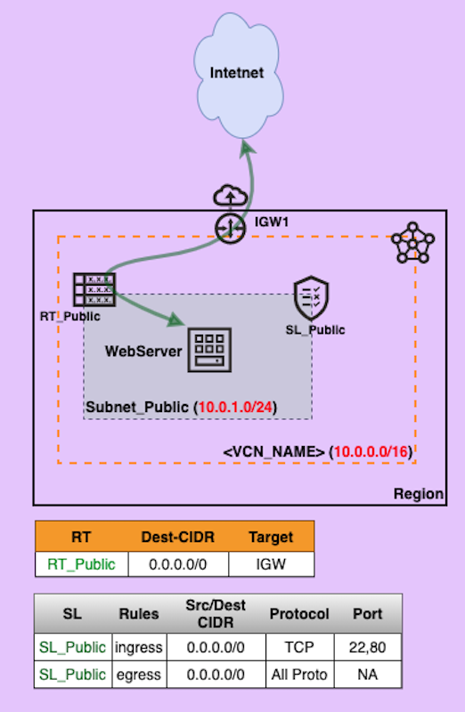

# SOL-100A-WEB : Using terraform - Quick WebServer in minute(s)

## Overview

The **terraform** **code** provisions a **VCN** with **Subnet_Public** and launch an **WebServer**. Just run and go :)

## Architecture

## Steps:

  1. Copy the scripts in a directory

     `$ cp -r scripts/Master01 /home/jahangir/MyWebServer01`

     `$ cd /home/jahangir/MyWebServer01`

     `$ mv terraform_sample.tfvars terraform.tfvars`

  2. Edit the file "terraform.tfvars" and assign value of all variables

  3. Execute terraform command(s)

     `$ terraform init`

     `$ terraform plan`

     `$ terraform apply`

  4. Get the public ip from terraform output and browse the website

  5. Once done to destroy the infrastructure along with WebServer

     `$ terraform destroy`

## Youtube Video: 

[SOL-100A-WEB](https:mylink)

